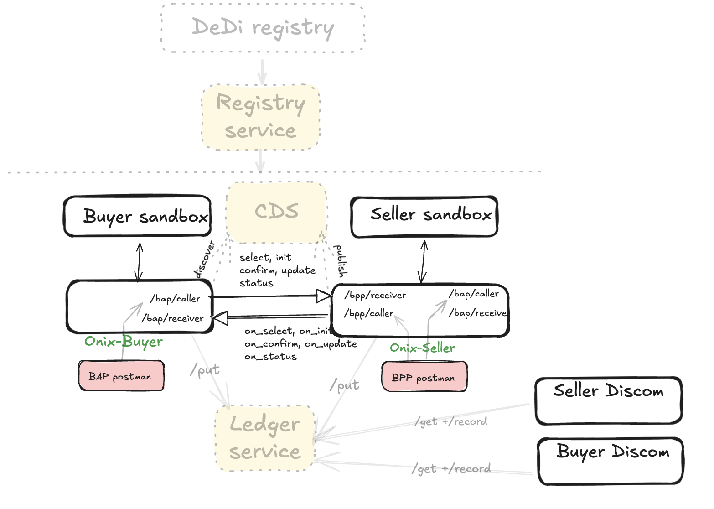

# P2P Trading Inter-Discom Devkit

Beckn Protocol v2.0 devkit for **peer-to-peer energy trading across discoms**. A buyer BAP discovers seller offers, negotiates a contract and settles — with optional cascaded messages to the seller's utility BPP for interdiscom coordination.

For the shared stack topology, prerequisites, Quick Start, transaction flow, hosting, ngrok notes, and cleanup, see [../README.md](../README.md).



## Use Cases

| Use Case | BAP (Buyer) | BPP (Seller) | UtilityBPP | Description |
|----------|-------------|--------------|------------|-------------|
| [uc1](./uc1/) | p2p-trading-sandbox1.com | p2p-trading-sandbox2.com | (cascaded) | Catalog → discover → select → confirm → status → settle, plus cascaded init/confirm to the seller's utility BPP |

## Catalog vs discover

This devkit's catalog service and discover service share the same hosted endpoint, so there is no `subscribe-catalog.sh` step. The `publish-catalog` and `discover` arazzo workflows talk to the same backend.

## Postman

`uc1-p2p-trading-ies-wave1/postman/p2p-trading-ies-wave1-uc1-p2p-trading-ies-wave1.{BAP,BPP,UtilityBPP}-DEG.postman_collection.json`. Collections are regenerated with `python3 scripts/generate_postman_collection.py --role BAP|BPP|UtilityBPP`.

Ancillary assets (bootcamp collection, verifiable-credential samples, ledger UI helpers) remain under `postman/` at the devkit root — they are not regenerated from examples.

## Network Configuration (defaults)

| Parameter | Value |
|-----------|-------|
| Domain | `beckn.one:deg:p2p-trading-interdiscom:2.0.0` |
| BAP ID | `p2p-trading-sandbox1.com` |
| BPP ID | `p2p-trading-sandbox2.com` |
| BAP host (router) | `http://beckn-router:9000` |
| BPP host (router) | `http://beckn-router:9000` |
| BAP adapter caller | `http://localhost:8081/bap/caller` |
| BPP adapter caller | `http://localhost:8082/bpp/caller` |

## References

- Beckn 2.0 sandbox [repo](https://github.com/beckn/sandbox), [image](https://hub.docker.com/r/fidedocker/sandbox-2.0)
- Beckn-Onix [repo](https://github.com/Beckn-One/beckn-onix), [image](https://hub.docker.com/r/fidedocker/onix-adapter)
- DeDi test registry: `https://publish-test.dedi.global/`
- Registry service (cache layer): `http://api.dev.beckn.io/registry`

## Dedi registry setup

A full walkthrough is available in the Beckn Labs docs: [publishing subscriber details](https://beckn-labs.gitbook.io/beckn-labs-docs/beckn-registry/publishing-subscriber-details) (with a [video](https://www.loom.com/share/e0293309701348dc95719a98b957d12c?sid=04b8dc00-51de-46ac-82ce-adc1a0060409)). The DeDi records for `p2p-trading-sandbox1.com` (BAP) and `p2p-trading-sandbox2.com` (BPP) are already provisioned for this devkit.

Public/private key pairs can be generated with the Beckn-Onix utility:

```bash
go run https://github.com/Beckn-One/beckn-onix/blob/main/install/generate-ed25519-keys.go
```

See [`./beckn-signing-kit/`](./beckn-signing-kit/) for language-specific signing reference implementations (Python, Node.js, Go, .NET).

## Troubleshooting

- If an onix container fails to start with `failed to load SchemaValidator plugin`, you may have a stale `fidedocker/onix-adapter-deg` image. Pull the tag referenced in `install/docker-compose.yml`.
- The devkit reuses DeDi records in `subscribers.beckn.one`; network-level rejects typically trace back to stale records there.

## Related

- [P2P Trading Devkit](../p2p-trading/) — pre-router layout with explicit UtilityBPP container, kept as-is
- [DEG Ledger UI kit](./deg-ledger-ui-kit/) — visualizer for discom/platform trade reports
