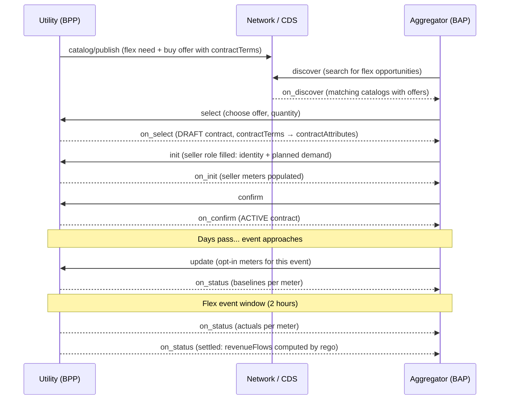

# Demand Flexibility Implementation Guide <!-- omit from toc -->

Version 0.2 (Draft / Non-Normative)

## Table of Contents <!-- omit from toc -->

- [1. Introduction](#1-introduction)
- [2. Terminology](#2-terminology)
- [3. User Journey](#3-user-journey)
- [4. Architecture](#4-architecture)
  - [4.1. Schemas](#41-schemas)
  - [4.2. Beckn v2 Contract Mapping](#42-beckn-v2-contract-mapping)
- [5. Message Flow](#5-message-flow)
  - [5.1. Catalog Publish](#51-catalog-publish)
  - [5.2. Discover](#52-discover)
  - [5.3. On Discover](#53-on-discover)
  - [5.4. Select](#54-select)
  - [5.5. On Select](#55-on-select)
  - [5.6. Init](#56-init)
  - [5.7. On Init](#57-on-init)
  - [5.8. Confirm](#58-confirm)
  - [5.9. On Confirm](#59-on-confirm)
  - [5.10. Update (Opt-In with Meters)](#510-update-opt-in-with-meters)
  - [5.11. On Status (Baselines)](#511-on-status-baselines)
  - [5.12. On Status (Actuals)](#512-on-status-actuals)
  - [5.13. On Status (Settled)](#513-on-status-settled)
- [6. Schema Reference](#6-schema-reference)
  - [6.1. DemandFlexNeed](#61-demandflexneed)
  - [6.2. DemandFlexBuyOffer](#62-demandflexbuyoffer)
  - [6.3. DEGContract](#63-degcontract)
  - [6.4. DemandFlexPerformance](#64-demandflexperformance)
- [7. Policy and Settlement](#7-policy-and-settlement)
- [8. Implementation Notes](#8-implementation-notes)
  - [8.1. For BAPs (Consumer / Aggregator)](#81-for-baps-consumer--aggregator)
  - [8.2. For BPPs (Utility)](#82-for-bpps-utility)
- [9. Devkit](#9-devkit)

---

## 1. Introduction

Behavioral Demand Response (also called demand-flex) allows utilities to procure load flexibility from consumers and aggregators during peak demand periods. Instead of building more generation or grid capacity, utilities publish flex needs on the network and incentivize participants to reduce (or shift) their consumption during specific event windows.

This guide describes how demand-flex contracts are modeled on the Beckn protocol using the v2.0.0 **Contract** object, with domain-specific schemas for the energy vertical (DEG).

### Key Concepts

- **Flex Need**: A utility's requirement for demand change (increase or reduction) during a specific event window
- **Buy Offer**: The commercial terms under which the utility will compensate flex providers, with role-tagged inputs
- **DEGContract**: A portable contract template carried in the offer, defining roles, policy, and (post-settlement) revenue flows
- **M&V (Measurement & Verification)**: Baselines and actuals used to compute verified flex
- **Rego Policy**: An OPA policy that computes revenue flows per role and verifies net-zero

## 2. Terminology

| Term | Definition |
|:-----|:-----------|
| **BAP** | Beckn Application Platform — the consumer or aggregator's system |
| **BPP** | Beckn Provider Platform — the utility's system |
| **Flex Event** | A time-bounded period during which demand change is needed |
| **Baseline** | Expected load per meter, computed from historical data (e.g., best 5 of last 10 days) |
| **Actual** | Measured load per meter during the flex event |
| **Curtailment** | Reduction in consumption below baseline |
| **Guaranteed Flex** | Firm commitment subject to penalty for under-delivery and premium for commitment |
| **Opt-In/Opt-Out** | Per-event participation control; default set in contract terms |
| **Revenue Flow** | Signed monetary value per role: negative = pays, positive = receives. Sum = 0 (net-zero) |

## 3. User Journey



### Offer → Contract Lifecycle

The `DemandFlexBuyOffer` carries two key structures:

1. **`contractTerms`** (type: `DEGContract`) — roles, policy reference, and (post-settlement) revenue flows. Present in the catalog. Promoted to `Contract.contractAttributes` at select/init.

2. **`inputs`** (array of `DemandFlexRoleInput`) — one entry per role. Buyer has `participantId` + commercial terms at catalog time. Seller is `null` until init, then filled with identity and meters.

```
Catalog / Discover:
  offer.offerAttributes.contractTerms → DEGContract {roles (unbound), policy}
  offer.offerAttributes.inputs → [{role:"buyer", participantId:"tpddl-...", inputs:{...}}, {role:"seller", participantId:null}]

Select → Init:
  contractAttributes → DEGContract {roles (bound to participantIds), policy}
  offer.offerAttributes.inputs → [{role:"buyer", ...}, {role:"seller", participantId:"greenflex-...", inputs:{...}}]

Post-Settlement:
  contractAttributes → DEGContract {roles, policy, revenueFlows: [{role:"buyer", value:-525}, {role:"seller", value:525}]}
```

## 4. Architecture

### 4.1. Schemas

Four domain schemas are used, each mapping to a specific attribute slot on the Beckn v2 Contract:

| Schema | Beckn Slot | Purpose |
|:-------|:-----------|:--------|
| **DemandFlexNeed** | `Resource.resourceAttributes` | What the utility needs: direction, event window, capacity, location |
| **DemandFlexBuyOffer** | `Offer.offerAttributes` | Role-tagged inputs + portable DEGContract template |
| **DEGContract** | `Contract.contractAttributes` | Roles, policy reference, computed revenue flows |
| **DemandFlexPerformance** | `Performance.performanceAttributes` | M&V data: methodology, per-meter baselines and actuals |

### 4.2. Beckn v2 Contract Mapping

```
Contract
├── status: DRAFT → ACTIVE → COMPLETE
├── commitments[]
│   ├── resources[]: DemandFlexNeed (what's needed)
│   └── offer
│       └── offerAttributes: DemandFlexBuyOffer
│           ├── inputs[]: [{role, participantId, inputs}] per role
│           └── contractTerms: DEGContract (catalog only, promoted at select)
├── performance[]: M&V baselines and actuals (on_status)
└── contractAttributes: DEGContract
    ├── roles[]: [{role, participantId}]
    ├── policy: {url, queryPath}
    └── revenueFlows[]: [{role, value, currency}] (post-settlement)
```

## 5. Message Flow

All examples use Beckn v2.0.0 with camelCase context fields (`bapId`, `bppId`, `transactionId`, `messageId`).

### 5.1. Catalog Publish

The utility publishes a flex catalog containing:
- A **Resource** with `DemandFlexNeed` attributes (direction, event window, capacity)
- An **Offer** with `DemandFlexBuyOffer` attributes containing `contractTerms` (the portable DEGContract template) and `inputs` (buyer terms filled, seller slot null)

<details><summary><a href="../../../../examples/demand-flex/v2/publish-catalog.json">publish-catalog.json</a></summary>

```json
{
  "context": {
    "version": "2.0.0",
    "action": "catalog/publish",
    "domain": "beckn.one:deg:demand-flex:2.0.0",
    "bppId": "tpddl-utility.example.com",
    "bppUri": "https://tpddl-utility.example.com/beckn",
    "messageId": "msg-publish-001",
    "timestamp": "2026-03-28T06:00:00Z",
    "schemaContext": [
      "https://raw.githubusercontent.com/beckn/DEG/refs/heads/main/specification/schema/DemandFlexBuyOffer/v2.0/context.jsonld",
      "https://raw.githubusercontent.com/beckn/DEG/refs/heads/main/specification/schema/DemandFlexNeed/v2.0/context.jsonld",
      "https://schema.beckn.io/Quantity/context.jsonld"
    ]
  },
  "message": {
    "catalogs": [
      {
        "id": "catalog-flex-tpddl-2026-04",
        "descriptor": {
          "name": "TPDDL Demand Flex - April 2026",
          "shortDesc": "Peak demand reduction opportunities for North Delhi"
        },
        "provider": {
          "id": "tpddl-north-delhi",
          "descriptor": {
            "name": "TPDDL North Delhi Distribution"
          }
        },
        "resources": [
          {
            "id": "flex-need-north-delhi-apr1",
            "descriptor": {
              "name": "Peak Demand Flex - North Delhi",
              "shortDesc": "500 kW curtailment needed Apr 1, 2-4pm IST"
            },
            "resourceAttributes": {
              "@context": "https://raw.githubusercontent.com/beckn/DEG/refs/heads/main/specification/schema/DemandFlexNeed/v2.0/context.jsonld",
              "@type": "DemandFlexNeed",
              "direction": "REDUCE",
              "eventWindow": {
                "startDate": "2026-04-01T08:30:00Z",
                "endDate": "2026-04-01T10:30:00Z"
              },
              "capacityType": "CURTAILMENT",
              "maxCapacityKw": 500,
              "location": {
                "type": "Point",
                "coordinates": [
                  77.209,
                  28.6139
                ]
              }
            }
          }
        ],
        "offers": [
          {
            "id": "offer-flex-001",
            "descriptor": {
              "name": "Standard Flex @ 3.50 INR/kWh",
              "shortDesc": "Demand reduction with 5.00 INR/kWh premium for guaranteed flex"
            },
            "resourceIds": [
              "flex-need-north-delhi-apr1"
            ],
            "validity": {
              "startDate": "2026-03-28T00:00:00Z",
              "endDate": "2026-04-01T08:30:00Z"
            },
            "availableTo": [
              {
                "type": "NETWORK",
                "id": "beckn.deg.india"
              }
            ],
            "offerAttributes": {
              "@context": "https://raw.githubusercontent.com/beckn/DEG/refs/heads/main/specification/schema/DemandFlexBuyOffer/v2.0/context.jsonld",
              "@type": "DemandFlexBuyOffer",
              "contractTerms": {
                "@context": "https://raw.githubusercontent.com/beckn/DEG/refs/heads/main/specification/schema/DEGContract/v2.0/context.jsonld",
                "@type": "DEGContract",
                "roles": [
                  {
                    "role": "buyer"
                  },
                  {
                    "role": "seller"
                  }
                ],
                "policy": {
                  "url": "https://raw.githubusercontent.com/beckn/DEG/refs/heads/main/specification/policies/demand_flex_revenue.rego",
                  "queryPath": "data.deg.contracts.demand_flex"
                }
              },
              "inputs": [
                {
                  "role": "buyer",
                  "participantId": "tpddl-north-delhi",
                  "inputs": {
                    "incentivePerKwh": 3.5,
                    "currency": "INR",
                    "baselineMethodology": {
                      "bestOf": 5,
                      "outOf": 10
                    },
                    "penaltyRate": 1.5,
                    "premiumForGuaranteed": 5.0,
                    "optOutDefault": false
                  }
                },
                {
                  "role": "seller",
                  "participantId": null
                }
              ]
            }
          }
        ]
      }
    ]
  }
}

```
</details>

### 5.2. Discover

The aggregator (BAP) searches the CDS for available flex opportunities matching their criteria.

<details><summary><a href="../../../../examples/demand-flex/v2/discover-request.json">discover-request.json</a></summary>

```json
{
  "context": {
    "version": "2.0.0",
    "action": "discover",
    "domain": "beckn.one:deg:demand-flex:2.0.0",
    "bapId": "greenflex-agg.example.com",
    "bapUri": "https://greenflex-agg.example.com/beckn",
    "transactionId": "txn-flex-001",
    "messageId": "msg-discover-001",
    "timestamp": "2026-03-30T09:55:00Z"
  },
  "message": {
    "intent": {
      "descriptor": {
        "name": "demand-flex"
      },
      "category": {
        "descriptor": {
          "code": "CURTAILMENT"
        }
      }
    }
  }
}

```
</details>

### 5.3. On Discover

The CDS returns matching catalogs. The offer carries the full `contractTerms` and buyer `inputs` from the catalog. The seller slot remains `null` — no aggregator has committed yet.

<details><summary><a href="../../../../examples/demand-flex/v2/on-discover-response.json">on-discover-response.json</a></summary>

```json
{
  "context": {
    "version": "2.0.0",
    "action": "on_discover",
    "domain": "beckn.one:deg:demand-flex:2.0.0",
    "bapId": "greenflex-agg.example.com",
    "bapUri": "https://greenflex-agg.example.com/beckn",
    "bppId": "tpddl-utility.example.com",
    "bppUri": "https://tpddl-utility.example.com/beckn",
    "transactionId": "txn-flex-001",
    "messageId": "msg-on-discover-001",
    "timestamp": "2026-03-30T09:55:05Z",
    "schemaContext": [
      "https://raw.githubusercontent.com/beckn/DEG/refs/heads/main/specification/schema/DemandFlexBuyOffer/v2.0/context.jsonld",
      "https://raw.githubusercontent.com/beckn/DEG/refs/heads/main/specification/schema/DemandFlexNeed/v2.0/context.jsonld",
      "https://schema.beckn.io/Quantity/context.jsonld"
    ]
  },
  "message": {
    "catalogs": [
      {
        "id": "catalog-flex-tpddl-2026-04",
        "descriptor": {
          "name": "TPDDL Demand Flex - April 2026",
          "shortDesc": "Peak demand reduction opportunities for North Delhi"
        },
        "provider": {
          "id": "tpddl-north-delhi",
          "descriptor": {
            "name": "TPDDL North Delhi Distribution"
          }
        },
        "resources": [
          {
            "id": "flex-need-north-delhi-apr1",
            "descriptor": {
              "name": "Peak Demand Flex - North Delhi",
              "shortDesc": "500 kW curtailment needed Apr 1, 2-4pm IST"
            },
            "resourceAttributes": {
              "@context": "https://raw.githubusercontent.com/beckn/DEG/refs/heads/main/specification/schema/DemandFlexNeed/v2.0/context.jsonld",
              "@type": "DemandFlexNeed",
              "direction": "REDUCE",
              "eventWindow": {
                "startDate": "2026-04-01T08:30:00Z",
                "endDate": "2026-04-01T10:30:00Z"
              },
              "capacityType": "CURTAILMENT",
              "maxCapacityKw": 500,
              "location": {
                "type": "Point",
                "coordinates": [77.209, 28.6139]
              }
            }
          }
        ],
        "offers": [
          {
            "id": "offer-flex-001",
            "descriptor": {
              "name": "Standard Flex @ 3.50 INR/kWh",
              "shortDesc": "Demand reduction with 5.00 INR/kWh premium for guaranteed flex"
            },
            "resourceIds": ["flex-need-north-delhi-apr1"],
            "validity": {
              "startDate": "2026-03-28T00:00:00Z",
              "endDate": "2026-04-01T08:30:00Z"
            },
            "offerAttributes": {
              "@context": "https://raw.githubusercontent.com/beckn/DEG/refs/heads/main/specification/schema/DemandFlexBuyOffer/v2.0/context.jsonld",
              "@type": "DemandFlexBuyOffer",
              "contractTerms": {
                "@context": "https://raw.githubusercontent.com/beckn/DEG/refs/heads/main/specification/schema/DEGContract/v2.0/context.jsonld",
                "@type": "DEGContract",
                "roles": [{"role": "buyer"}, {"role": "seller"}],
                "policy": {
                  "url": "https://raw.githubusercontent.com/beckn/DEG/refs/heads/main/specification/policies/demand_flex_revenue.rego",
                  "queryPath": "data.deg.contracts.demand_flex"
                }
              },
              "inputs": [
                {
                  "role": "buyer",
                  "participantId": "tpddl-north-delhi",
                  "inputs": {
                    "incentivePerKwh": 3.5,
                    "currency": "INR",
                    "baselineMethodology": {"bestOf": 5, "outOf": 10},
                    "penaltyRate": 1.5,
                    "premiumForGuaranteed": 5.0,
                    "optOutDefault": false
                  }
                },
                {
                  "role": "seller",
                  "participantId": null
                }
              ]
            }
          }
        ]
      }
    ]
  }
}

```
</details>

### 5.4. Select

The aggregator selects an offer with a desired quantity. The `contractTerms` from the offer is now promoted to `contractAttributes` on the contract. Seller `inputs` remain `null` at this stage.

<details><summary><a href="../../../../examples/demand-flex/v2/select-request.json">select-request.json</a></summary>

```json
{
  "context": {
    "version": "2.0.0",
    "action": "select",
    "domain": "beckn.one:deg:demand-flex:2.0.0",
    "bapId": "greenflex-agg.example.com",
    "bapUri": "https://greenflex-agg.example.com/beckn",
    "bppId": "tpddl-utility.example.com",
    "bppUri": "https://tpddl-utility.example.com/beckn",
    "transactionId": "txn-flex-001",
    "messageId": "msg-select-001",
    "timestamp": "2026-03-30T10:00:00Z",
    "schemaContext": [
      "https://raw.githubusercontent.com/beckn/DEG/refs/heads/main/specification/schema/DemandFlexBuyOffer/v2.0/context.jsonld",
      "https://raw.githubusercontent.com/beckn/DEG/refs/heads/main/specification/schema/DemandFlexNeed/v2.0/context.jsonld",
      "https://raw.githubusercontent.com/beckn/DEG/refs/heads/main/specification/schema/DEGContract/v2.0/context.jsonld",
      "https://schema.beckn.io/Quantity/context.jsonld"
    ]
  },
  "message": {
    "contract": {
      "status": {
        "code": "DRAFT"
      },
      "commitments": [
        {
          "status": {
            "descriptor": {
              "code": "DRAFT"
            }
          },
          "resources": [
            {
              "id": "flex-need-north-delhi-apr1",
              "descriptor": {
                "name": "Peak Demand Flex - North Delhi",
                "shortDesc": "500 kW curtailment needed Apr 1, 2-4pm IST"
              },
              "quantity": {
                "unitCode": "kW",
                "unitQuantity": 150,
                "@type": "Quantity"
              },
              "resourceAttributes": {
                "@context": "https://raw.githubusercontent.com/beckn/DEG/refs/heads/main/specification/schema/DemandFlexNeed/v2.0/context.jsonld",
                "@type": "DemandFlexNeed",
                "direction": "REDUCE",
                "eventWindow": {
                  "startDate": "2026-04-01T08:30:00Z",
                  "endDate": "2026-04-01T10:30:00Z"
                },
                "capacityType": "CURTAILMENT",
                "maxCapacityKw": 500,
                "location": {
                  "type": "Point",
                  "coordinates": [
                    77.209,
                    28.6139
                  ]
                }
              }
            }
          ],
          "offer": {
            "id": "offer-flex-001",
            "resourceIds": [
              "flex-need-north-delhi-apr1"
            ],
            "offerAttributes": {
              "@context": "https://raw.githubusercontent.com/beckn/DEG/refs/heads/main/specification/schema/DemandFlexBuyOffer/v2.0/context.jsonld",
              "@type": "DemandFlexBuyOffer",
              "inputs": [
                {
                  "role": "buyer",
                  "participantId": "tpddl-north-delhi",
                  "inputs": {
                    "incentivePerKwh": 3.5,
                    "currency": "INR",
                    "baselineMethodology": {
                      "bestOf": 5,
                      "outOf": 10
                    },
                    "penaltyRate": 1.5,
                    "premiumForGuaranteed": 5.0,
                    "optOutDefault": false
                  }
                },
                {
                  "role": "seller",
                  "participantId": null
                }
              ]
            }
          }
        }
      ],
      "contractAttributes": {
        "@context": "https://raw.githubusercontent.com/beckn/DEG/refs/heads/main/specification/schema/DEGContract/v2.0/context.jsonld",
        "@type": "DEGContract",
        "roles": [
          {
            "role": "buyer"
          },
          {
            "role": "seller"
          }
        ],
        "policy": {
          "url": "https://raw.githubusercontent.com/beckn/DEG/refs/heads/main/specification/policies/demand_flex_revenue.rego",
          "queryPath": "data.deg.contracts.demand_flex"
        }
      }
    }
  }
}

```
</details>

### 5.5. On Select

The BPP returns a DRAFT contract. The `contractAttributes` carries the `DEGContract` with roles (buyer bound, seller unbound). No `contractTerms` in the offer — it has been promoted.

<details><summary><a href="../../../../examples/demand-flex/v2/on-select-response.json">on-select-response.json</a></summary>

```json
{
  "context": {
    "version": "2.0.0",
    "action": "on_select",
    "domain": "beckn.one:deg:demand-flex:2.0.0",
    "bapId": "greenflex-agg.example.com",
    "bapUri": "https://greenflex-agg.example.com/beckn",
    "bppId": "tpddl-utility.example.com",
    "bppUri": "https://tpddl-utility.example.com/beckn",
    "transactionId": "txn-flex-001",
    "messageId": "msg-on-select-001",
    "timestamp": "2026-03-30T10:00:05Z",
    "schemaContext": [
      "https://raw.githubusercontent.com/beckn/DEG/refs/heads/main/specification/schema/DemandFlexBuyOffer/v2.0/context.jsonld",
      "https://raw.githubusercontent.com/beckn/DEG/refs/heads/main/specification/schema/DemandFlexNeed/v2.0/context.jsonld",
      "https://raw.githubusercontent.com/beckn/DEG/refs/heads/main/specification/schema/DEGContract/v2.0/context.jsonld",
      "https://schema.beckn.io/Quantity/context.jsonld"
    ]
  },
  "message": {
    "contract": {
      "status": {
        "code": "DRAFT"
      },
      "commitments": [
        {
          "id": "commitment-flex-001",
          "status": {
            "descriptor": {
              "code": "DRAFT"
            }
          },
          "resources": [
            {
              "id": "flex-need-north-delhi-apr1",
              "descriptor": {
                "name": "Peak Demand Flex - North Delhi"
              },
              "quantity": {
                "unitCode": "kW",
                "unitQuantity": 150,
                "@type": "Quantity"
              },
              "resourceAttributes": {
                "@context": "https://raw.githubusercontent.com/beckn/DEG/refs/heads/main/specification/schema/DemandFlexNeed/v2.0/context.jsonld",
                "@type": "DemandFlexNeed",
                "direction": "REDUCE",
                "eventWindow": {
                  "startDate": "2026-04-01T08:30:00Z",
                  "endDate": "2026-04-01T10:30:00Z"
                },
                "capacityType": "CURTAILMENT",
                "maxCapacityKw": 500,
                "location": {
                  "type": "Point",
                  "coordinates": [
                    77.209,
                    28.6139
                  ]
                }
              }
            }
          ],
          "offer": {
            "id": "offer-flex-001",
            "resourceIds": [
              "flex-need-north-delhi-apr1"
            ],
            "offerAttributes": {
              "@context": "https://raw.githubusercontent.com/beckn/DEG/refs/heads/main/specification/schema/DemandFlexBuyOffer/v2.0/context.jsonld",
              "@type": "DemandFlexBuyOffer",
              "inputs": [
                {
                  "role": "buyer",
                  "participantId": "tpddl-north-delhi",
                  "inputs": {
                    "incentivePerKwh": 3.5,
                    "currency": "INR",
                    "baselineMethodology": {
                      "bestOf": 5,
                      "outOf": 10
                    },
                    "penaltyRate": 1.5,
                    "premiumForGuaranteed": 5.0,
                    "optOutDefault": false
                  }
                },
                {
                  "role": "seller",
                  "participantId": null
                }
              ]
            }
          }
        }
      ],
      "contractAttributes": {
        "@context": "https://raw.githubusercontent.com/beckn/DEG/refs/heads/main/specification/schema/DEGContract/v2.0/context.jsonld",
        "@type": "DEGContract",
        "roles": [
          {
            "role": "buyer"
          },
          {
            "role": "seller"
          }
        ],
        "policy": {
          "url": "https://raw.githubusercontent.com/beckn/DEG/refs/heads/main/specification/policies/demand_flex_revenue.rego",
          "queryPath": "data.deg.contracts.demand_flex"
        }
      }
    }
  }
}

```
</details>

### 5.6. Init

The aggregator provides their identity. The seller role in `inputs` is now filled with `participantId` and `inputs` (planned demand change, participating meters). The seller role in `contractAttributes.roles` is also bound.

<details><summary><a href="../../../../examples/demand-flex/v2/init-request.json">init-request.json</a></summary>

```json
{
  "context": {
    "version": "2.0.0",
    "action": "init",
    "domain": "beckn.one:deg:demand-flex:2.0.0",
    "bapId": "greenflex-agg.example.com",
    "bapUri": "https://greenflex-agg.example.com/beckn",
    "bppId": "tpddl-utility.example.com",
    "bppUri": "https://tpddl-utility.example.com/beckn",
    "transactionId": "txn-flex-001",
    "messageId": "msg-init-001",
    "timestamp": "2026-03-30T10:05:00Z",
    "schemaContext": [
      "https://raw.githubusercontent.com/beckn/DEG/refs/heads/main/specification/schema/DemandFlexBuyOffer/v2.0/context.jsonld",
      "https://raw.githubusercontent.com/beckn/DEG/refs/heads/main/specification/schema/DemandFlexNeed/v2.0/context.jsonld",
      "https://raw.githubusercontent.com/beckn/DEG/refs/heads/main/specification/schema/DEGContract/v2.0/context.jsonld",
      "https://schema.beckn.io/Quantity/context.jsonld"
    ]
  },
  "message": {
    "contract": {
      "status": {
        "code": "DRAFT"
      },
      "commitments": [
        {
          "id": "commitment-flex-001",
          "status": {
            "descriptor": {
              "code": "DRAFT"
            }
          },
          "resources": [
            {
              "id": "flex-need-north-delhi-apr1",
              "descriptor": {
                "name": "Peak Demand Flex - North Delhi",
                "shortDesc": "500 kW curtailment needed Apr 1, 2-4pm IST"
              },
              "quantity": {
                "unitCode": "kW",
                "unitQuantity": 150,
                "@type": "Quantity"
              },
              "resourceAttributes": {
                "@context": "https://raw.githubusercontent.com/beckn/DEG/refs/heads/main/specification/schema/DemandFlexNeed/v2.0/context.jsonld",
                "@type": "DemandFlexNeed",
                "direction": "REDUCE",
                "eventWindow": {
                  "startDate": "2026-04-01T08:30:00Z",
                  "endDate": "2026-04-01T10:30:00Z"
                },
                "capacityType": "CURTAILMENT",
                "maxCapacityKw": 500,
                "location": {
                  "type": "Point",
                  "coordinates": [
                    77.209,
                    28.6139
                  ]
                }
              }
            }
          ],
          "offer": {
            "id": "offer-flex-001",
            "resourceIds": [
              "flex-need-north-delhi-apr1"
            ],
            "offerAttributes": {
              "@context": "https://raw.githubusercontent.com/beckn/DEG/refs/heads/main/specification/schema/DemandFlexBuyOffer/v2.0/context.jsonld",
              "@type": "DemandFlexBuyOffer",
              "inputs": [
                {
                  "role": "buyer",
                  "participantId": "tpddl-north-delhi",
                  "inputs": {
                    "incentivePerKwh": 3.5,
                    "currency": "INR",
                    "baselineMethodology": {
                      "bestOf": 5,
                      "outOf": 10
                    },
                    "penaltyRate": 1.5,
                    "premiumForGuaranteed": 5.0,
                    "optOutDefault": false
                  }
                },
                {
                  "role": "seller",
                  "participantId": "greenflex-agg",
                  "inputs": {
                    "plannedDemandChange": {
                      "unitCode": "KWH",
                      "unitQuantity": 150.0,
                      "@type": "Quantity"
                    },
                    "participatingMeters": [
                      "der://meter/001",
                      "der://meter/002"
                    ]
                  }
                }
              ]
            }
          }
        }
      ],
      "contractAttributes": {
        "@context": "https://raw.githubusercontent.com/beckn/DEG/refs/heads/main/specification/schema/DEGContract/v2.0/context.jsonld",
        "@type": "DEGContract",
        "roles": [
          {
            "role": "buyer",
            "participantId": "tpddl-north-delhi"
          },
          {
            "role": "seller",
            "participantId": "greenflex-agg"
          }
        ],
        "policy": {
          "url": "https://raw.githubusercontent.com/beckn/DEG/refs/heads/main/specification/policies/demand_flex_revenue.rego",
          "queryPath": "data.deg.contracts.demand_flex"
        }
      }
    }
  }
}

```
</details>

### 5.7. On Init

The BPP acknowledges the seller and populates the initial set of participating meters.

<details><summary><a href="../../../../examples/demand-flex/v2/on-init-response.json">on-init-response.json</a></summary>

```json
{
  "context": {
    "version": "2.0.0",
    "action": "on_init",
    "domain": "beckn.one:deg:demand-flex:2.0.0",
    "bapId": "greenflex-agg.example.com",
    "bapUri": "https://greenflex-agg.example.com/beckn",
    "bppId": "tpddl-utility.example.com",
    "bppUri": "https://tpddl-utility.example.com/beckn",
    "transactionId": "txn-flex-001",
    "messageId": "msg-on-init-001",
    "timestamp": "2026-03-30T10:05:05Z",
    "schemaContext": [
      "https://raw.githubusercontent.com/beckn/DEG/refs/heads/main/specification/schema/DemandFlexBuyOffer/v2.0/context.jsonld",
      "https://raw.githubusercontent.com/beckn/DEG/refs/heads/main/specification/schema/DemandFlexNeed/v2.0/context.jsonld",
      "https://raw.githubusercontent.com/beckn/DEG/refs/heads/main/specification/schema/DEGContract/v2.0/context.jsonld",
      "https://schema.beckn.io/Quantity/context.jsonld"
    ]
  },
  "message": {
    "contract": {
      "status": {
        "code": "DRAFT"
      },
      "commitments": [
        {
          "id": "commitment-flex-001",
          "status": {
            "descriptor": {
              "code": "DRAFT"
            }
          },
          "resources": [
            {
              "id": "flex-need-north-delhi-apr1",
              "descriptor": {
                "name": "Peak Demand Flex - North Delhi"
              },
              "quantity": {
                "unitCode": "kW",
                "unitQuantity": 150,
                "@type": "Quantity"
              },
              "resourceAttributes": {
                "@context": "https://raw.githubusercontent.com/beckn/DEG/refs/heads/main/specification/schema/DemandFlexNeed/v2.0/context.jsonld",
                "@type": "DemandFlexNeed",
                "direction": "REDUCE",
                "eventWindow": {
                  "startDate": "2026-04-01T08:30:00Z",
                  "endDate": "2026-04-01T10:30:00Z"
                },
                "capacityType": "CURTAILMENT",
                "maxCapacityKw": 500,
                "location": {
                  "type": "Point",
                  "coordinates": [
                    77.209,
                    28.6139
                  ]
                }
              }
            }
          ],
          "offer": {
            "id": "offer-flex-001",
            "resourceIds": [
              "flex-need-north-delhi-apr1"
            ],
            "offerAttributes": {
              "@context": "https://raw.githubusercontent.com/beckn/DEG/refs/heads/main/specification/schema/DemandFlexBuyOffer/v2.0/context.jsonld",
              "@type": "DemandFlexBuyOffer",
              "inputs": [
                {
                  "role": "buyer",
                  "participantId": "tpddl-north-delhi",
                  "inputs": {
                    "incentivePerKwh": 3.5,
                    "currency": "INR",
                    "baselineMethodology": {
                      "bestOf": 5,
                      "outOf": 10
                    },
                    "penaltyRate": 1.5,
                    "premiumForGuaranteed": 5.0,
                    "optOutDefault": false
                  }
                },
                {
                  "role": "seller",
                  "participantId": "greenflex-agg",
                  "inputs": {
                    "plannedDemandChange": {
                      "unitCode": "KWH",
                      "unitQuantity": 150.0,
                      "@type": "Quantity"
                    },
                    "participatingMeters": [
                      "der://meter/001",
                      "der://meter/002"
                    ]
                  }
                }
              ]
            }
          }
        }
      ],
      "contractAttributes": {
        "@context": "https://raw.githubusercontent.com/beckn/DEG/refs/heads/main/specification/schema/DEGContract/v2.0/context.jsonld",
        "@type": "DEGContract",
        "roles": [
          {
            "role": "buyer",
            "participantId": "tpddl-north-delhi"
          },
          {
            "role": "seller",
            "participantId": "greenflex-agg"
          }
        ],
        "policy": {
          "url": "https://raw.githubusercontent.com/beckn/DEG/refs/heads/main/specification/policies/demand_flex_revenue.rego",
          "queryPath": "data.deg.contracts.demand_flex"
        }
      }
    }
  }
}

```
</details>

### 5.8. Confirm

The aggregator confirms the contract. Same structure as init.

<details><summary><a href="../../../../examples/demand-flex/v2/confirm-request.json">confirm-request.json</a></summary>

```json
{
  "context": {
    "version": "2.0.0",
    "action": "confirm",
    "domain": "beckn.one:deg:demand-flex:2.0.0",
    "bapId": "greenflex-agg.example.com",
    "bapUri": "https://greenflex-agg.example.com/beckn",
    "bppId": "tpddl-utility.example.com",
    "bppUri": "https://tpddl-utility.example.com/beckn",
    "transactionId": "txn-flex-001",
    "messageId": "msg-confirm-001",
    "timestamp": "2026-03-30T10:10:00Z",
    "schemaContext": [
      "https://raw.githubusercontent.com/beckn/DEG/refs/heads/main/specification/schema/DemandFlexBuyOffer/v2.0/context.jsonld",
      "https://raw.githubusercontent.com/beckn/DEG/refs/heads/main/specification/schema/DemandFlexNeed/v2.0/context.jsonld",
      "https://raw.githubusercontent.com/beckn/DEG/refs/heads/main/specification/schema/DEGContract/v2.0/context.jsonld",
      "https://schema.beckn.io/Quantity/context.jsonld"
    ]
  },
  "message": {
    "contract": {
      "status": {
        "code": "DRAFT"
      },
      "commitments": [
        {
          "id": "commitment-flex-001",
          "status": {
            "descriptor": {
              "code": "DRAFT"
            }
          },
          "resources": [
            {
              "id": "flex-need-north-delhi-apr1",
              "descriptor": {
                "name": "Peak Demand Flex - North Delhi",
                "shortDesc": "500 kW curtailment needed Apr 1, 2-4pm IST"
              },
              "quantity": {
                "unitCode": "kW",
                "unitQuantity": 150,
                "@type": "Quantity"
              },
              "resourceAttributes": {
                "@context": "https://raw.githubusercontent.com/beckn/DEG/refs/heads/main/specification/schema/DemandFlexNeed/v2.0/context.jsonld",
                "@type": "DemandFlexNeed",
                "direction": "REDUCE",
                "eventWindow": {
                  "startDate": "2026-04-01T08:30:00Z",
                  "endDate": "2026-04-01T10:30:00Z"
                },
                "capacityType": "CURTAILMENT",
                "maxCapacityKw": 500,
                "location": {
                  "type": "Point",
                  "coordinates": [
                    77.209,
                    28.6139
                  ]
                }
              }
            }
          ],
          "offer": {
            "id": "offer-flex-001",
            "resourceIds": [
              "flex-need-north-delhi-apr1"
            ],
            "offerAttributes": {
              "@context": "https://raw.githubusercontent.com/beckn/DEG/refs/heads/main/specification/schema/DemandFlexBuyOffer/v2.0/context.jsonld",
              "@type": "DemandFlexBuyOffer",
              "inputs": [
                {
                  "role": "buyer",
                  "participantId": "tpddl-north-delhi",
                  "inputs": {
                    "incentivePerKwh": 3.5,
                    "currency": "INR",
                    "baselineMethodology": {
                      "bestOf": 5,
                      "outOf": 10
                    },
                    "penaltyRate": 1.5,
                    "premiumForGuaranteed": 5.0,
                    "optOutDefault": false
                  }
                },
                {
                  "role": "seller",
                  "participantId": "greenflex-agg",
                  "inputs": {
                    "plannedDemandChange": {
                      "unitCode": "KWH",
                      "unitQuantity": 150.0,
                      "@type": "Quantity"
                    },
                    "participatingMeters": [
                      "der://meter/001",
                      "der://meter/002"
                    ]
                  }
                }
              ]
            }
          }
        }
      ],
      "contractAttributes": {
        "@context": "https://raw.githubusercontent.com/beckn/DEG/refs/heads/main/specification/schema/DEGContract/v2.0/context.jsonld",
        "@type": "DEGContract",
        "roles": [
          {
            "role": "buyer",
            "participantId": "tpddl-north-delhi"
          },
          {
            "role": "seller",
            "participantId": "greenflex-agg"
          }
        ],
        "policy": {
          "url": "https://raw.githubusercontent.com/beckn/DEG/refs/heads/main/specification/policies/demand_flex_revenue.rego",
          "queryPath": "data.deg.contracts.demand_flex"
        }
      }
    }
  }
}

```
</details>

### 5.9. On Confirm

The BPP activates the contract. Status changes to `ACTIVE`. The contract is now firm.

<details><summary><a href="../../../../examples/demand-flex/v2/on-confirm-response.json">on-confirm-response.json</a></summary>

```json
{
  "context": {
    "version": "2.0.0",
    "action": "on_confirm",
    "domain": "beckn.one:deg:demand-flex:2.0.0",
    "bapId": "greenflex-agg.example.com",
    "bapUri": "https://greenflex-agg.example.com/beckn",
    "bppId": "tpddl-utility.example.com",
    "bppUri": "https://tpddl-utility.example.com/beckn",
    "transactionId": "txn-flex-001",
    "messageId": "msg-on-confirm-001",
    "timestamp": "2026-03-30T10:10:05Z",
    "schemaContext": [
      "https://raw.githubusercontent.com/beckn/DEG/refs/heads/main/specification/schema/DemandFlexBuyOffer/v2.0/context.jsonld",
      "https://raw.githubusercontent.com/beckn/DEG/refs/heads/main/specification/schema/DemandFlexNeed/v2.0/context.jsonld",
      "https://raw.githubusercontent.com/beckn/DEG/refs/heads/main/specification/schema/DEGContract/v2.0/context.jsonld",
      "https://schema.beckn.io/Quantity/context.jsonld"
    ]
  },
  "message": {
    "contract": {
      "id": "contract-flex-001",
      "status": {
        "code": "ACTIVE"
      },
      "commitments": [
        {
          "id": "commitment-flex-001",
          "status": {
            "descriptor": {
              "code": "ACTIVE"
            }
          },
          "resources": [
            {
              "id": "flex-need-north-delhi-apr1",
              "descriptor": {
                "name": "Peak Demand Flex - North Delhi"
              },
              "quantity": {
                "unitCode": "kW",
                "unitQuantity": 150,
                "@type": "Quantity"
              },
              "resourceAttributes": {
                "@context": "https://raw.githubusercontent.com/beckn/DEG/refs/heads/main/specification/schema/DemandFlexNeed/v2.0/context.jsonld",
                "@type": "DemandFlexNeed",
                "direction": "REDUCE",
                "eventWindow": {
                  "startDate": "2026-04-01T08:30:00Z",
                  "endDate": "2026-04-01T10:30:00Z"
                },
                "capacityType": "CURTAILMENT",
                "maxCapacityKw": 500,
                "location": {
                  "type": "Point",
                  "coordinates": [
                    77.209,
                    28.6139
                  ]
                }
              }
            }
          ],
          "offer": {
            "id": "offer-flex-001",
            "resourceIds": [
              "flex-need-north-delhi-apr1"
            ],
            "offerAttributes": {
              "@context": "https://raw.githubusercontent.com/beckn/DEG/refs/heads/main/specification/schema/DemandFlexBuyOffer/v2.0/context.jsonld",
              "@type": "DemandFlexBuyOffer",
              "inputs": [
                {
                  "role": "buyer",
                  "participantId": "tpddl-north-delhi",
                  "inputs": {
                    "incentivePerKwh": 3.5,
                    "currency": "INR",
                    "baselineMethodology": {
                      "bestOf": 5,
                      "outOf": 10
                    },
                    "penaltyRate": 1.5,
                    "premiumForGuaranteed": 5.0,
                    "optOutDefault": false
                  }
                },
                {
                  "role": "seller",
                  "participantId": "greenflex-agg",
                  "inputs": {
                    "plannedDemandChange": {
                      "unitCode": "KWH",
                      "unitQuantity": 150.0,
                      "@type": "Quantity"
                    },
                    "participatingMeters": [
                      "der://meter/001",
                      "der://meter/002"
                    ]
                  }
                }
              ]
            }
          }
        }
      ],
      "contractAttributes": {
        "@context": "https://raw.githubusercontent.com/beckn/DEG/refs/heads/main/specification/schema/DEGContract/v2.0/context.jsonld",
        "@type": "DEGContract",
        "roles": [
          {
            "role": "buyer",
            "participantId": "tpddl-north-delhi"
          },
          {
            "role": "seller",
            "participantId": "greenflex-agg"
          }
        ],
        "policy": {
          "url": "https://raw.githubusercontent.com/beckn/DEG/refs/heads/main/specification/policies/demand_flex_revenue.rego",
          "queryPath": "data.deg.contracts.demand_flex"
        }
      }
    }
  }
}

```
</details>

### 5.10. Update (Opt-In with Meters)

The aggregator updates the participating meters list before an event. The seller `inputs` in `offerAttributes` are updated with the new meter list and planned demand change.

<details><summary><a href="../../../../examples/demand-flex/v2/update-request-opt-in.json">update-request-opt-in.json</a></summary>

```json
{
  "context": {
    "version": "2.0.0",
    "action": "update",
    "domain": "beckn.one:deg:demand-flex:2.0.0",
    "bapId": "greenflex-agg.example.com",
    "bapUri": "https://greenflex-agg.example.com/beckn",
    "bppId": "tpddl-utility.example.com",
    "bppUri": "https://tpddl-utility.example.com/beckn",
    "transactionId": "txn-flex-001",
    "messageId": "msg-update-optin-001",
    "timestamp": "2026-04-01T06:00:00Z",
    "schemaContext": [
      "https://raw.githubusercontent.com/beckn/DEG/refs/heads/main/specification/schema/DemandFlexBuyOffer/v2.0/context.jsonld",
      "https://raw.githubusercontent.com/beckn/DEG/refs/heads/main/specification/schema/DemandFlexNeed/v2.0/context.jsonld",
      "https://raw.githubusercontent.com/beckn/DEG/refs/heads/main/specification/schema/DEGContract/v2.0/context.jsonld",
      "https://schema.beckn.io/Quantity/context.jsonld"
    ]
  },
  "message": {
    "contract": {
      "id": "contract-flex-001",
      "commitments": [
        {
          "id": "commitment-flex-001",
          "status": {
            "descriptor": {
              "code": "ACTIVE"
            }
          },
          "resources": [
            {
              "id": "flex-need-north-delhi-apr1",
              "quantity": {
                "unitCode": "kW",
                "unitQuantity": 120,
                "@type": "Quantity"
              },
              "resourceAttributes": {
                "@context": "https://raw.githubusercontent.com/beckn/DEG/refs/heads/main/specification/schema/DemandFlexNeed/v2.0/context.jsonld",
                "@type": "DemandFlexNeed",
                "direction": "REDUCE",
                "eventWindow": {
                  "startDate": "2026-04-01T08:30:00Z",
                  "endDate": "2026-04-01T10:30:00Z"
                },
                "capacityType": "CURTAILMENT",
                "maxCapacityKw": 500,
                "location": {
                  "type": "Point",
                  "coordinates": [
                    77.209,
                    28.6139
                  ]
                }
              }
            }
          ],
          "offer": {
            "id": "offer-flex-001",
            "resourceIds": [
              "flex-need-north-delhi-apr1"
            ],
            "offerAttributes": {
              "@context": "https://raw.githubusercontent.com/beckn/DEG/refs/heads/main/specification/schema/DemandFlexBuyOffer/v2.0/context.jsonld",
              "@type": "DemandFlexBuyOffer",
              "inputs": [
                {
                  "role": "buyer",
                  "participantId": "tpddl-north-delhi",
                  "inputs": {
                    "incentivePerKwh": 3.5,
                    "currency": "INR",
                    "baselineMethodology": {
                      "bestOf": 5,
                      "outOf": 10
                    },
                    "penaltyRate": 1.5,
                    "premiumForGuaranteed": 5.0,
                    "optOutDefault": false
                  }
                },
                {
                  "role": "seller",
                  "participantId": "greenflex-agg",
                  "inputs": {
                    "plannedDemandChange": {
                      "unitCode": "KWH",
                      "unitQuantity": 120.0,
                      "@type": "Quantity"
                    },
                    "participatingMeters": [
                      "der://meter/001",
                      "der://meter/002",
                      "der://meter/003"
                    ]
                  }
                }
              ]
            }
          }
        }
      ],
      "contractAttributes": {
        "@context": "https://raw.githubusercontent.com/beckn/DEG/refs/heads/main/specification/schema/DEGContract/v2.0/context.jsonld",
        "@type": "DEGContract",
        "roles": [
          {
            "role": "buyer",
            "participantId": "tpddl-utility.example.com"
          },
          {
            "role": "seller",
            "participantId": "greenflex-agg.example.com"
          }
        ],
        "policy": {
          "url": "https://raw.githubusercontent.com/beckn/DEG/refs/heads/main/specification/policies/demand_flex_revenue.rego",
          "queryPath": "data.deg.contracts.demand_flex"
        }
      }
    }
  }
}

```
</details>

### 5.11. On Status (Baselines)

Before the event, the utility publishes baseline load per meter. The `DemandFlexPerformance` attributes contain per-meter `baselineKw` values (no `actualKw` yet).

<details><summary><a href="../../../../examples/demand-flex/v2/on-status-response-baselines.json">on-status-response-baselines.json</a></summary>

```json
{
  "context": {
    "version": "2.0.0",
    "action": "on_status",
    "domain": "beckn.one:deg:demand-flex:2.0.0",
    "bapId": "greenflex-agg.example.com",
    "bapUri": "https://greenflex-agg.example.com/beckn",
    "bppId": "tpddl-utility.example.com",
    "bppUri": "https://tpddl-utility.example.com/beckn",
    "transactionId": "txn-flex-001",
    "messageId": "msg-on-status-baselines-001",
    "timestamp": "2026-04-01T08:00:00Z",
    "schemaContext": [
      "https://raw.githubusercontent.com/beckn/DEG/refs/heads/main/specification/schema/DemandFlexPerformance/v2.0/context.jsonld",
      "https://raw.githubusercontent.com/beckn/DEG/refs/heads/main/specification/schema/DemandFlexNeed/v2.0/context.jsonld",
      "https://raw.githubusercontent.com/beckn/DEG/refs/heads/main/specification/schema/DEGContract/v2.0/context.jsonld",
      "https://schema.beckn.io/Quantity/context.jsonld",
      "https://raw.githubusercontent.com/beckn/DEG/refs/heads/main/specification/schema/DemandFlexBuyOffer/v2.0/context.jsonld"
    ]
  },
  "message": {
    "contract": {
      "id": "contract-flex-001",
      "status": {
        "code": "ACTIVE"
      },
      "commitments": [
        {
          "id": "commitment-flex-001",
          "status": {
            "descriptor": {
              "code": "ACTIVE"
            }
          },
          "resources": [
            {
              "id": "flex-need-north-delhi-apr1",
              "quantity": {
                "unitCode": "kW",
                "unitQuantity": 150,
                "@type": "Quantity"
              },
              "resourceAttributes": {
                "@context": "https://raw.githubusercontent.com/beckn/DEG/refs/heads/main/specification/schema/DemandFlexNeed/v2.0/context.jsonld",
                "@type": "DemandFlexNeed",
                "direction": "REDUCE",
                "eventWindow": {
                  "startDate": "2026-04-01T08:30:00Z",
                  "endDate": "2026-04-01T10:30:00Z"
                },
                "capacityType": "CURTAILMENT",
                "maxCapacityKw": 500
              }
            }
          ],
          "offer": {
            "id": "offer-flex-001",
            "resourceIds": [
              "flex-need-north-delhi-apr1"
            ],
            "offerAttributes": {
              "@context": "https://raw.githubusercontent.com/beckn/DEG/refs/heads/main/specification/schema/DemandFlexBuyOffer/v2.0/context.jsonld",
              "@type": "DemandFlexBuyOffer",
              "inputs": [
                {
                  "role": "buyer",
                  "participantId": "tpddl-north-delhi",
                  "inputs": {
                    "incentivePerKwh": 3.5,
                    "currency": "INR",
                    "baselineMethodology": {
                      "bestOf": 5,
                      "outOf": 10
                    },
                    "penaltyRate": 1.5,
                    "premiumForGuaranteed": 5.0,
                    "optOutDefault": false
                  }
                },
                {
                  "role": "seller",
                  "participantId": "greenflex-agg",
                  "inputs": {
                    "plannedDemandChange": {
                      "@type": "Quantity",
                      "unitCode": "KWH",
                      "unitQuantity": 150.0
                    },
                    "participatingMeters": [
                      "der://meter/001",
                      "der://meter/002",
                      "der://meter/003"
                    ]
                  }
                }
              ]
            }
          }
        }
      ],
      "performance": [
        {
          "id": "perf-evt-001-baselines",
          "status": {
            "code": "BASELINE_PUBLISHED",
            "name": "Baselines published for upcoming event"
          },
          "commitmentIds": [
            "commitment-flex-001"
          ],
          "performanceAttributes": {
            "@context": "https://raw.githubusercontent.com/beckn/DEG/refs/heads/main/specification/schema/DemandFlexPerformance/v2.0/context.jsonld",
            "@type": "DemandFlexPerformance",
            "eventId": "evt-2026-04-01-001",
            "methodology": "5of10",
            "meters": [
              {
                "meterId": "der://meter/001",
                "baselineKw": 45.0
              },
              {
                "meterId": "der://meter/002",
                "baselineKw": 38.0
              },
              {
                "meterId": "der://meter/003",
                "baselineKw": 52.0
              }
            ]
          }
        }
      ],
      "contractAttributes": {
        "@context": "https://raw.githubusercontent.com/beckn/DEG/refs/heads/main/specification/schema/DEGContract/v2.0/context.jsonld",
        "@type": "DEGContract",
        "roles": [
          {
            "role": "buyer",
            "participantId": "tpddl-north-delhi"
          },
          {
            "role": "seller",
            "participantId": "greenflex-agg"
          }
        ],
        "policy": {
          "url": "https://raw.githubusercontent.com/beckn/DEG/refs/heads/main/specification/policies/demand_flex_revenue.rego",
          "queryPath": "data.deg.contracts.demand_flex"
        }
      }
    }
  }
}

```
</details>

### 5.12. On Status (Actuals)

After the event, the utility publishes actual load per meter alongside baselines. The `DemandFlexPerformance` attributes now contain both `baselineKw` and `actualKw` per meter.

<details><summary><a href="../../../../examples/demand-flex/v2/on-status-response-actuals.json">on-status-response-actuals.json</a></summary>

```json
{
  "context": {
    "version": "2.0.0",
    "action": "on_status",
    "domain": "beckn.one:deg:demand-flex:2.0.0",
    "bapId": "greenflex-agg.example.com",
    "bapUri": "https://greenflex-agg.example.com/beckn",
    "bppId": "tpddl-utility.example.com",
    "bppUri": "https://tpddl-utility.example.com/beckn",
    "transactionId": "txn-flex-001",
    "messageId": "msg-on-status-actuals-001",
    "timestamp": "2026-04-01T10:35:00Z",
    "schemaContext": [
      "https://raw.githubusercontent.com/beckn/DEG/refs/heads/main/specification/schema/DemandFlexPerformance/v2.0/context.jsonld",
      "https://raw.githubusercontent.com/beckn/DEG/refs/heads/main/specification/schema/DemandFlexNeed/v2.0/context.jsonld",
      "https://raw.githubusercontent.com/beckn/DEG/refs/heads/main/specification/schema/DEGContract/v2.0/context.jsonld",
      "https://schema.beckn.io/Quantity/context.jsonld",
      "https://raw.githubusercontent.com/beckn/DEG/refs/heads/main/specification/schema/DemandFlexBuyOffer/v2.0/context.jsonld"
    ]
  },
  "message": {
    "contract": {
      "id": "contract-flex-001",
      "status": {
        "code": "ACTIVE"
      },
      "commitments": [
        {
          "id": "commitment-flex-001",
          "status": {
            "descriptor": {
              "code": "ACTIVE"
            }
          },
          "resources": [
            {
              "id": "flex-need-north-delhi-apr1",
              "quantity": {
                "unitCode": "kW",
                "unitQuantity": 150,
                "@type": "Quantity"
              },
              "resourceAttributes": {
                "@context": "https://raw.githubusercontent.com/beckn/DEG/refs/heads/main/specification/schema/DemandFlexNeed/v2.0/context.jsonld",
                "@type": "DemandFlexNeed",
                "direction": "REDUCE",
                "eventWindow": {
                  "startDate": "2026-04-01T08:30:00Z",
                  "endDate": "2026-04-01T10:30:00Z"
                },
                "capacityType": "CURTAILMENT",
                "maxCapacityKw": 500
              }
            }
          ],
          "offer": {
            "id": "offer-flex-001",
            "resourceIds": [
              "flex-need-north-delhi-apr1"
            ],
            "offerAttributes": {
              "@context": "https://raw.githubusercontent.com/beckn/DEG/refs/heads/main/specification/schema/DemandFlexBuyOffer/v2.0/context.jsonld",
              "@type": "DemandFlexBuyOffer",
              "inputs": [
                {
                  "role": "buyer",
                  "participantId": "tpddl-north-delhi",
                  "inputs": {
                    "incentivePerKwh": 3.5,
                    "currency": "INR",
                    "baselineMethodology": {
                      "bestOf": 5,
                      "outOf": 10
                    },
                    "penaltyRate": 1.5,
                    "premiumForGuaranteed": 5.0,
                    "optOutDefault": false
                  }
                },
                {
                  "role": "seller",
                  "participantId": "greenflex-agg",
                  "inputs": {
                    "plannedDemandChange": {
                      "@type": "Quantity",
                      "unitCode": "KWH",
                      "unitQuantity": 150.0
                    },
                    "participatingMeters": [
                      "der://meter/001",
                      "der://meter/002",
                      "der://meter/003"
                    ]
                  }
                }
              ]
            }
          }
        }
      ],
      "performance": [
        {
          "id": "perf-evt-001-actuals",
          "status": {
            "code": "DELIVERY_COMPLETE",
            "name": "Event completed, actuals measured"
          },
          "commitmentIds": [
            "commitment-flex-001"
          ],
          "performanceAttributes": {
            "@context": "https://raw.githubusercontent.com/beckn/DEG/refs/heads/main/specification/schema/DemandFlexPerformance/v2.0/context.jsonld",
            "@type": "DemandFlexPerformance",
            "eventId": "evt-2026-04-01-001",
            "methodology": "5of10",
            "meters": [
              {
                "meterId": "der://meter/001",
                "baselineKw": 45.0,
                "actualKw": 20.0
              },
              {
                "meterId": "der://meter/002",
                "baselineKw": 38.0,
                "actualKw": 15.0
              },
              {
                "meterId": "der://meter/003",
                "baselineKw": 52.0,
                "actualKw": 25.0
              }
            ]
          }
        }
      ],
      "contractAttributes": {
        "@context": "https://raw.githubusercontent.com/beckn/DEG/refs/heads/main/specification/schema/DEGContract/v2.0/context.jsonld",
        "@type": "DEGContract",
        "roles": [
          {
            "role": "buyer",
            "participantId": "tpddl-north-delhi"
          },
          {
            "role": "seller",
            "participantId": "greenflex-agg"
          }
        ],
        "policy": {
          "url": "https://raw.githubusercontent.com/beckn/DEG/refs/heads/main/specification/policies/demand_flex_revenue.rego",
          "queryPath": "data.deg.contracts.demand_flex"
        }
      }
    }
  }
}

```
</details>

### 5.13. On Status (Settled)

The rego policy is evaluated against the actuals payload. Revenue flows are computed per role and injected into `contractAttributes.revenueFlows`. The sum of all flows equals zero (net-zero verified).

<details><summary><a href="../../../../examples/demand-flex/v2/on-status-response-settled.json">on-status-response-settled.json</a></summary>

```json
{
  "context": {
    "version": "2.0.0",
    "action": "on_status",
    "domain": "beckn.one:deg:demand-flex:2.0.0",
    "bapId": "greenflex-agg.example.com",
    "bapUri": "https://greenflex-agg.example.com/beckn",
    "bppId": "tpddl-utility.example.com",
    "bppUri": "https://tpddl-utility.example.com/beckn",
    "transactionId": "txn-flex-001",
    "messageId": "msg-on-status-settled-001",
    "timestamp": "2026-04-01T11:00:00Z",
    "schemaContext": [
      "https://raw.githubusercontent.com/beckn/DEG/refs/heads/main/specification/schema/DemandFlexPerformance/v2.0/context.jsonld",
      "https://raw.githubusercontent.com/beckn/DEG/refs/heads/main/specification/schema/DemandFlexNeed/v2.0/context.jsonld",
      "https://raw.githubusercontent.com/beckn/DEG/refs/heads/main/specification/schema/DemandFlexBuyOffer/v2.0/context.jsonld",
      "https://raw.githubusercontent.com/beckn/DEG/refs/heads/main/specification/schema/DEGContract/v2.0/context.jsonld",
      "https://schema.beckn.io/Quantity/context.jsonld"
    ]
  },
  "message": {
    "contract": {
      "id": "contract-flex-001",
      "status": {
        "code": "ACTIVE"
      },
      "commitments": [
        {
          "id": "commitment-flex-001",
          "status": {
            "descriptor": {
              "code": "ACTIVE"
            }
          },
          "resources": [
            {
              "id": "flex-need-north-delhi-apr1",
              "quantity": {
                "unitCode": "kW",
                "unitQuantity": 150,
                "@type": "Quantity"
              },
              "resourceAttributes": {
                "@context": "https://raw.githubusercontent.com/beckn/DEG/refs/heads/main/specification/schema/DemandFlexNeed/v2.0/context.jsonld",
                "@type": "DemandFlexNeed",
                "direction": "REDUCE",
                "eventWindow": {
                  "startDate": "2026-04-01T08:30:00Z",
                  "endDate": "2026-04-01T10:30:00Z"
                },
                "capacityType": "CURTAILMENT",
                "maxCapacityKw": 500
              }
            }
          ],
          "offer": {
            "id": "offer-flex-001",
            "resourceIds": [
              "flex-need-north-delhi-apr1"
            ],
            "offerAttributes": {
              "@context": "https://raw.githubusercontent.com/beckn/DEG/refs/heads/main/specification/schema/DemandFlexBuyOffer/v2.0/context.jsonld",
              "@type": "DemandFlexBuyOffer",
              "inputs": [
                {
                  "role": "buyer",
                  "participantId": "tpddl-north-delhi",
                  "inputs": {
                    "incentivePerKwh": 3.5,
                    "currency": "INR",
                    "baselineMethodology": {
                      "bestOf": 5,
                      "outOf": 10
                    },
                    "penaltyRate": 1.5,
                    "premiumForGuaranteed": 5.0,
                    "optOutDefault": false
                  }
                },
                {
                  "role": "seller",
                  "participantId": "greenflex-agg",
                  "inputs": {
                    "plannedDemandChange": {
                      "unitCode": "KWH",
                      "unitQuantity": 120.0,
                      "@type": "Quantity"
                    },
                    "participatingMeters": [
                      "der://meter/001",
                      "der://meter/002",
                      "der://meter/003"
                    ]
                  }
                }
              ]
            }
          }
        }
      ],
      "performance": [
        {
          "id": "perf-evt-001-actuals",
          "status": {
            "code": "SETTLED",
            "name": "Settlement computed from policy evaluation"
          },
          "commitmentIds": [
            "commitment-flex-001"
          ],
          "performanceAttributes": {
            "@context": "https://raw.githubusercontent.com/beckn/DEG/refs/heads/main/specification/schema/DemandFlexPerformance/v2.0/context.jsonld",
            "@type": "DemandFlexPerformance",
            "eventId": "evt-2026-04-01-001",
            "methodology": "5of10",
            "meters": [
              {
                "meterId": "der://meter/001",
                "baselineKw": 45.0,
                "actualKw": 20.0
              },
              {
                "meterId": "der://meter/002",
                "baselineKw": 38.0,
                "actualKw": 15.0
              },
              {
                "meterId": "der://meter/003",
                "baselineKw": 52.0,
                "actualKw": 25.0
              }
            ]
          }
        }
      ],
      "contractAttributes": {
        "@context": "https://raw.githubusercontent.com/beckn/DEG/refs/heads/main/specification/schema/DEGContract/v2.0/context.jsonld",
        "@type": "DEGContract",
        "roles": [
          {
            "role": "buyer",
            "participantId": "tpddl-north-delhi"
          },
          {
            "role": "seller",
            "participantId": "greenflex-agg"
          }
        ],
        "policy": {
          "url": "https://raw.githubusercontent.com/beckn/DEG/refs/heads/main/specification/policies/demand_flex_revenue.rego",
          "queryPath": "data.deg.contracts.demand_flex"
        },
        "revenueFlows": [
          {
            "currency": "INR",
            "description": "Incentive payable for 150 kWh verified curtailment",
            "role": "buyer",
            "value": -525
          },
          {
            "currency": "INR",
            "description": "Incentive receivable for 150 kWh verified curtailment",
            "role": "seller",
            "value": 525
          }
        ]
      }
    }
  }
}

```
</details>

## 6. Schema Reference

### 6.1. DemandFlexNeed

Attached to `Resource.resourceAttributes`. Describes the utility's flex requirement.

| Field | Type | Required | Description |
|:------|:-----|:---------|:------------|
| `direction` | string | Yes | `INCREASE` or `REDUCE` |
| `eventWindow` | object | Yes | `{startDate, endDate}` in UTC ISO 8601 |
| `maxCapacityKw` | number | Yes | Maximum flex capacity in kW |
| `capacityType` | string | No | `CURTAILMENT`, `SHIFT`, or `GENERATION` |
| `location` | object | No | GeoJSON Point or Polygon |

### 6.2. DemandFlexBuyOffer

Attached to `Offer.offerAttributes`. Contains the contract template and role-tagged inputs.

| Field | Type | Required | Description |
|:------|:-----|:---------|:------------|
| `contractTerms` | DEGContract | Catalog only | Portable contract template — promoted to `contractAttributes` at select |
| `inputs` | array | Yes | One `DemandFlexRoleInput` per role |

**DemandFlexRoleInput:**

| Field | Type | Required | Description |
|:------|:-----|:---------|:------------|
| `role` | string | Yes | `buyer` or `seller` |
| `participantId` | string/null | Yes | Null until role is bound |
| `inputs` | object | When bound | Role-specific commercial terms |

**Buyer inputs:** `incentivePerKwh`, `currency`, `baselineMethodology`, `penaltyRate`, `premiumForGuaranteed`, `optOutDefault`

**Seller inputs:** `plannedDemandChange` (beckn:Quantity), `participatingMeters` (string array)

### 6.3. DEGContract

Carried in `offerAttributes.contractTerms` (catalog) and promoted to `Contract.contractAttributes` (contract stages).

| Field | Type | Required | Description |
|:------|:-----|:---------|:------------|
| `roles` | array | Yes | `[{role, participantId?}]` — bound at init/confirm |
| `policy` | object | Yes | `{url, queryPath}` — OPA/Rego policy reference |
| `revenueFlows` | array | Post-settlement | `[{role, value, currency}]` — computed by rego |

### 6.4. DemandFlexPerformance

Attached to `Performance.performanceAttributes` in `on_status` callbacks.

| Field | Type | Required | Description |
|:------|:-----|:---------|:------------|
| `eventId` | string | No | Identifier of the flex event |
| `methodology` | string | No | Baseline methodology (e.g., `5of10`) |
| `meters` | array | No | Per-meter M&V: `{meterId, baselineKw, actualKw?}` |

## 7. Policy and Settlement

The demand-flex rego policy ([demand_flex_revenue.rego](../../../../specification/policies/demand_flex_revenue.rego)) is a pure function:

**Inputs** (from the contract payload):
- `contractAttributes.roles[]` — buyer / seller
- `commitments[0].offer.offerAttributes.inputs[]` — buyer's incentive rate
- `commitments[0].resources[0].resourceAttributes.eventWindow` — event duration
- `performance[0].performanceAttributes.meters[]` — baselines + actuals

**Outputs:**
- `revenue_flows` — `[{role:"buyer", value:-525, currency:"INR"}, {role:"seller", value:525, currency:"INR"}]`
- `settlement_components` — per-meter breakdown
- `net_zero_ok` — boolean (sum of all flows == 0)
- `violations` — warnings (missing actuals, negative reductions clamped, etc.)

**Net-zero invariant:** The buyer pays exactly what the seller receives. Sum of all `revenue_flows[].value` = 0.

### Running locally

```bash
# Run OPA tests
cd specification/policies && opa test demand_flex_revenue.rego demand_flex_revenue_test.rego -v

# Evaluate against an example
python3 scripts/evaluate_demand_flex_settlement.py examples/demand-flex/v2/on-status-response-settled.json

# Generate settled JSON with revenueFlows injected
python3 scripts/evaluate_demand_flex_settlement.py \
  examples/demand-flex/v2/on-status-response-actuals.json \
  --generate examples/demand-flex/v2/on-status-response-settled.json
```

### In the onix pipeline

The `revenueflows` middleware plugin runs on BPP Caller `on_status` messages. It reads the policy URL from `contractAttributes.policy`, fetches and caches the rego at runtime, evaluates it, and injects `revenueFlows` into the message body before signing.

## 8. Implementation Notes

### 8.1. For BAPs (Consumer / Aggregator)

- Send `/discover` to the CDS to find flex opportunities matching your criteria
- The offer's `contractTerms` contains the DEGContract template with roles and policy
- At `/init`, fill the seller role in `inputs` with your `participantId` and `plannedDemandChange`
- Use `/update` before each event to update `participatingMeters` and `plannedDemandChange`
- Revenue flows in `on_status` (settled) show what you receive — verify against the rego policy

### 8.2. For BPPs (Utility)

- Publish catalog with `contractTerms` in the offer — defines roles, policy, and buyer terms
- At `/on_select`, promote `contractTerms` to `contractAttributes` and bind buyer role
- At `/on_init`, bind seller role in `contractAttributes.roles`
- Send baselines via `on_status` before the event, actuals after
- The `revenueflows` middleware computes and injects revenue flows automatically on `on_status`
- All quantity fields use `beckn:Quantity` with `@type: "Quantity"` and `unitCode`/`unitQuantity`

## 9. Devkit

The demand-flex devkit provides a complete local testnet:

```bash
# Start the devkit
docker compose -f devkits/demand-flex/install/docker-compose-demand-flex.yml up -d

# Import Postman collections
# BAP: devkits/demand-flex/postman/demand-flex.BAP-DEG.postman_collection.json
# BPP: devkits/demand-flex/postman/demand-flex.BPP-DEG.postman_collection.json
```

| Component | Port | Description |
|:----------|:-----|:------------|
| onix-bap | 8081 | BAP adapter (Aggregator) |
| onix-bpp | 8082 | BPP adapter (Utility) with revenueflows middleware |
| sandbox-bap | 3001 | BAP sandbox |
| sandbox-bpp | 3002 | BPP sandbox |
| redis | 6379 | Cache |
