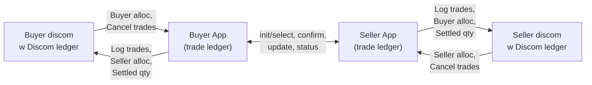
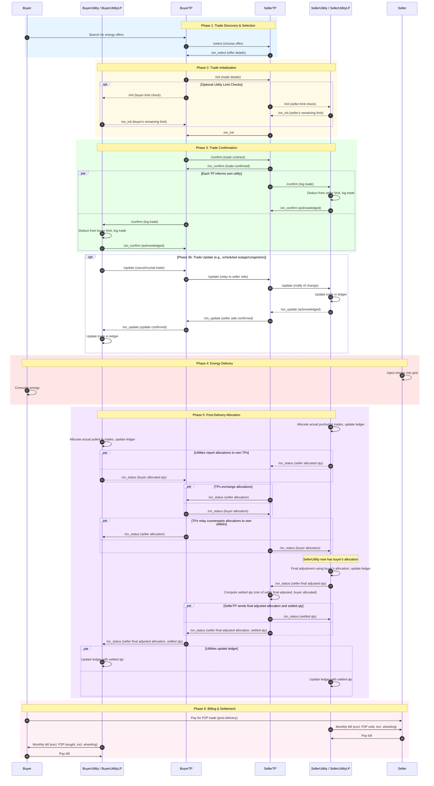
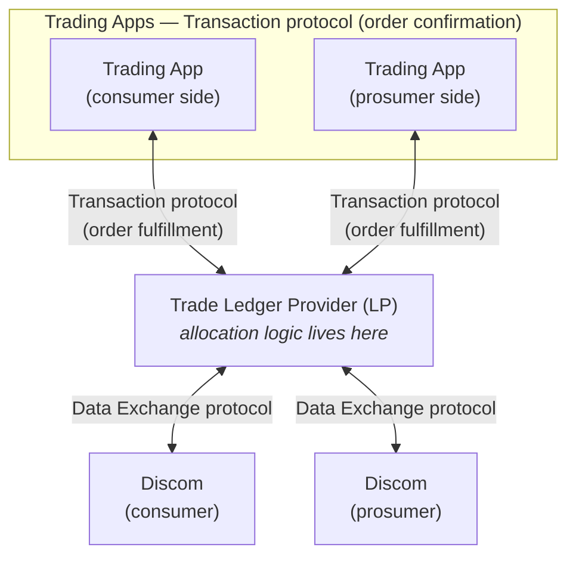

# Inter-Energy Retailer P2P Energy Trading

## Overview

This document describes inter-utility peer to peer energy trading architecture, that allows for distributed databases and multi-ledgers to facilitate the transactions, allocations & settlements.

For the original approach using a central ledger, see [Inter_energy_retailer_P2P_trading_draft.md](./Inter_energy_retailer_P2P_trading_draft.md).

---

## Scenario

P2P trading between prosumers belonging to different energy retailers/distribution utilities (discoms). Each discom handles routine activities: providing electricity connections, certifying meters, billing, maintaining grid infrastructure, and ensuring grid resilience within their jurisdiction.

**Example:** A seller (Meter ID: M1, Utility A) sells electricity to a buyer (Meter ID: M7, Utility B).

---

## Key Architectural Difference

| Aspect | Central Ledger Approach | Decentralized Approach |
|--------|------------------------|------------------------|
| Trade records | Single central ledger (Trade Exchange) | Each utility or their ledger provider (LP) maintains its own ledger |
| Trust model | All parties trust the central ledger | Multi-party signatures create distributed proof |
| Trading limits | Central ledger tracks all limits | Each utility tracks only its own customers' limits |
| Reconciliation | Central ledger allocates actual energy | Each utility or its LP allocates for its own customers |
| Privacy | Central entity sees all trade details | Each utility only sees trades involving its customers |

---

## Actors

| # | Actor | Role | Beckn Role |
|---|-------|------|------------|
| 1 | **BuyerTP** | Consumer's trading platform | BAP when requesting, BPP when responding |
| 2 | **SellerTP** | Producer's trading platform | BAP when requesting, BPP when responding |
| 3 | **BuyerUtility / BuyerUtilityLP** | Buyer's energy retailer/distribution company, optionally acting through its contracted **Ledger Provider (LP)** | BAP when requesting, BPP when responding |
| 4 | **SellerUtility / SellerUtilityLP** | Seller's energy retailer/distribution company, optionally acting through its contracted **Ledger Provider (LP)** | BAP when requesting, BPP when responding |
| 5 | **Buyer** | Energy consumer in P2P trade | End user |
| 6 | **Seller** | Energy producer in P2P trade | End user |

> **Note:** When buyer and seller are with the **same utility**, the flow simplifies naturally - BuyerUtility and SellerUtility collapse into a single entity, reducing the number of hops while maintaining the same protocol structure.

> **Note on LP (Ledger Service Provider):** A Ledger TSP is a **regulated technical service provider** that may act on behalf of a utility for the trade-ledger and allocation functions in this protocol. The LP is responsible for fair allocation as per network policy and is contracted by the utility. **Each utility contracts exactly one LP**. The sequence diagram below uses the combined label `<Utility> / <Utility>LP` because the same flow applies whether the utility runs the ledger itself or delegates to its LP. See [§ Operating Through a Ledger TSP (LP)](#operating-through-a-ledger-service-provider-LP) for the LP-mediated topology.

---

## Core Design Principles

1. **Symmetric TP-liaison model**: Each trading platform acts as the liaison to its own utility, and relays allocations from one ledger to another.
2. **Privacy-preserving information flow**: Only allocations are exchanged between TPs and utilities — not customer IDs, PII, or meter data. Price information stays between trading platforms only. Intra-discom trade data stays in the discom's own ledger.
3. **Utility involvement patterns**: Utility participation during init is optional, and only needed when trading platforms don't have the trading limits imposed by the utility. After the trade is confirmed, each TP sends a non-blocking intimation to its own utility, informing them of the trade so they can avoid double-billing and compute wheeling and under-fulfillment charges post delivery. Utilities can independently track and publish trade reliability scores (e.g., Credit score for energy delivery).
4. **Distributed ledgers**: Each utility maintains its own ledger for its customers only
5. **Natural collapse**: Same-utility trades collapse to single-discom flow automatically

---

## Architecture Overview

> **Key properties:** Each TP acts as the liaison to the customer's utility. Trade protocol flows (init, select, confirm, update, status) and prices stay between TPs. Each customer's PII data only stays with trading platform & utility they have formally enrolled with. It does not get sent to other systems without their consent. Only allocations and settled quantities cross the TP-utility boundary — not other discom's customer IDs, PII, meter data, or price information. Intra-discom trade data stays in the discom's own ledger.

---

## Ledger Contents

| Field | Utility Ledger | TP Ledger |
|-------|:-:|:-:|
| **Common fields** | | |
| trade_id | Yes | Yes |
| meter/customer info | Yes | Yes |
| trade qty | Yes | Yes |
| delivery start_time | Yes | Yes |
| delivery end_time | Yes | Yes |
| allocated qty | Yes | Yes |
| counterparty's allocation | Yes | Yes |
| settled_qty | Yes | Yes |
| trade status | Yes | Yes |
| **Utility only** | | |
| actual qty (from meter data) | Yes | — |
| **TP only** | | |
| price | — | Yes |

### Data Residency Summary

- **Customer data** (IDs, PII, meter info) stays with the customer's own trading platform and utility — it is not shared with counterparty systems except as allocations.
- **Meter data** (actual injection/consumption readings) stays with the utility alone.
- **Price data** stays with the two trading platforms only — utilities never see trade prices.

---

## Overall Process Flow

---

## Phase 5: Post-Delivery Allocation and Status

After the delivery window, each utility independently allocates actual meter readings to its own customers' trades and reports to its own TP. The TPs exchange these allocations and relay the counterparty's allocation back to their respective utilities. Once SellerUtility receives BuyerUtility's allocation (via BuyerTP → SellerTP → SellerUtility), it performs a final adjustment informed by the buyer's allocation and sends the result to SellerTP. SellerTP then computes the settled quantity using the min-of-two rule (minimum of seller's final adjusted allocation and buyer's allocation), and sends both the final adjusted allocation and settled quantity to SellerUtility and BuyerTP in parallel. BuyerTP relays both to BuyerUtility.

### Why Allocation Matters

A prosumer or consumer may have multiple trades in the same delivery window but inject/consume less than the total contracted amount. Each utility must allocate actual meter readings to specific trades to determine:
- What quantity was actually delivered/received for each trade
- What to include in billing adjustments
- Whether penalties apply for under-fulfillment

### Allocation Example (Pro-rata)

**Seller's trades for delivery window 2-4 PM:**

| Trade | Contracted Qty | Share of Total |
|-------|----------------|----------------|
| T1 (with Buyer A) | 5 kWh | 5/9 ≈ 55.6% |
| T2 (with Buyer B) | 4 kWh | 4/9 ≈ 44.4% |
| **Total** | **9 kWh** | **100%** |

**Actual injection: 7 kWh**

**SellerUtility allocation (pro-rata):** Under-fulfillment (7 of 9 kWh) is distributed proportionally across all trades for that meter and time block.

| Trade | Contracted | Allocated | Status |
|-------|------------|-----------|--------|
| T1 | 5 kWh | 3.89 kWh (5/9 × 7) | Partial delivery |
| T2 | 4 kWh | 3.11 kWh (4/9 × 7) | Partial delivery |

SellerUtility sends `/on_status` to SellerTP with these allocated quantities.

Once both discoms' allocations reach both trading platforms and are relayed to the respective utilities, SellerUtility performs a final adjustment informed by the buyer's allocation and sends it to SellerTP. SellerTP computes the settled quantity (minimum of seller's final adjusted allocation and buyer's allocation) and sends both the final adjusted allocation and settled quantity to SellerUtility and BuyerTP in parallel. BuyerTP relays both to BuyerUtility. Trading platforms use this final settled volume to exchange peer-to-peer payment, and discoms use it to avoid double billing.

---

## Operating Through a Ledger Service Provider (LP)

A **Ledger TSP (LP)** is a regulated technical service provider that may act on behalf of a utility for the trade-ledger and fair-allocation functions described above. The LP is bound by the network policy to enforce fair allocation, hold the utility's distributed trade ledger, and answer protocol requests on the utility's behalf. **Each utility contracts exactly one LP** (for start); two different utilities may contract the **same** LP or **different** LPs — the protocol does not assume a single shared ledger.

### When the same sequence diagram still holds

For utilities that choose to operate via their LP — or where network policy mandates this — the [Overall Process Flow](#overall-process-flow) sequence diagram above applies **unchanged**. The only substitution is at the participant level:

- Wherever `BuyerUtility` appears, the calls are made by `BuyerUtilityLP` on behalf of the buyer's utility.
- Wherever `SellerUtility` appears, the calls are made by `SellerUtilityLP` on behalf of the seller's utility.

Trade ledger writes, limit checks, pro-rata allocation, final adjustment, and settled-qty propagation all execute inside the LP — keyed to the utility whose customers are involved. This is why the sequence diagram labels its utility participants as `<Utility> / <Utility>LP`: the protocol is identical and only the operator changes.

### LP as a full Beckn node

When an LP is in the path it acts as a **full-fledged Beckn node** for the utility it represents. Specifically the LP:

- **Receives `/confirm` calls** from the trading platform (and from BAP/BPP in cascaded flows) and writes the trade into that utility's ledger, deducting from the customer's trading limits per network policy.
- **Raises cascaded `/status` requests** downstream to the discom's meter/billing systems (e.g., to fetch the actual injection/consumption for a meter-block), and folds the responses back into the protocol flow.
- **Issues `/on_status` updates** upstream to the TP carrying seller/buyer allocations, the final-adjusted allocation, and the settled qty — exactly as the utility itself would.
- **Receives `/update` calls** (e.g., scheduled outage / curtailment) from the utility-side and propagates them through the protocol per the diagram above.
- **Performs the fair pro-rata allocation and final adjustment** per the regulator-approved network policy, so allocation logic is consistent across utilities that share an LP and auditable across those that don't.

### Multi-ledger topology

Because each utility independently picks an LP, real deployments will be a **multi-ledger network**:

- **Same LP across utilities.** Utility A and Utility B may contract the same LP. The LP runs **two logically separated ledgers** (one per utility) and behaves as **two distinct Beckn nodes** in the sequence diagram. No data crosses the per-utility partition.
- **Different LPs.** Utility A and Utility B may contract different LPs. Each LP runs its own utility's ledger, and the cross-utility hops in the sequence diagram cross an **LP-to-LP boundary** (one LP acts as `BuyerUtilityLP`, the other as `SellerUtilityLP`).
- **Mixed.** Some utilities may run their own ledger and others may delegate to an LP — the sequence diagram still holds because each utility's participant slot is filled by whichever entity is operating that utility's ledger.

The decentralized base-protocol design guarantees this works: trades and limits are partitioned per utility, so adding, removing, or swapping an LP is local to a single utility and never requires global reconciliation.

### Reference architecture

The block diagram below summarises the LP-mediated topology — sourced from *Final P2P Ledger and Allocation Architecture* (Pramod Varma, 15 April 2025).

**Reading the diagram:**

- **Trading apps** speak the Beckn **transaction protocol (order confirmation)** directly to each other — price, contract, settled-qty exchange. This is the row labelled "TP-to-TP" in the sequence diagram above.
- **Each trading app** speaks the Beckn **transaction protocol (order fulfillment)** to its utility's LP — limit checks, trade logging, allocation reporting, settled-qty relay. This is the row labelled "TP-to-utility" in the sequence diagram above.
- **Each discom** sends meter data to Ledger provider  over beckn protocol, as a data-exchange use case, and receives allocation data back.

**Why this matters:** allocation logic moves to the LP layer — consistent across utilities that share an LP, regulator-auditable across those that don't, and simple to integrate for discoms that keep their existing internal stack. The architecture begins with one LP per utility, but the partitioned design preserves the option to scale to **multiple LPs per network** without changes to the underlying protocol.